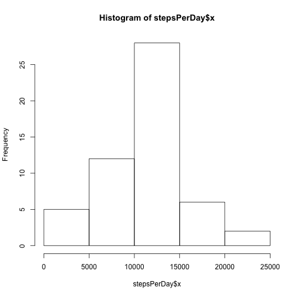
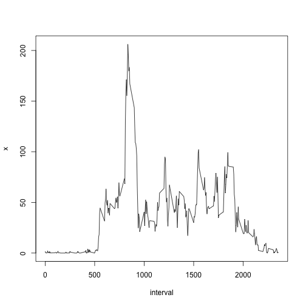
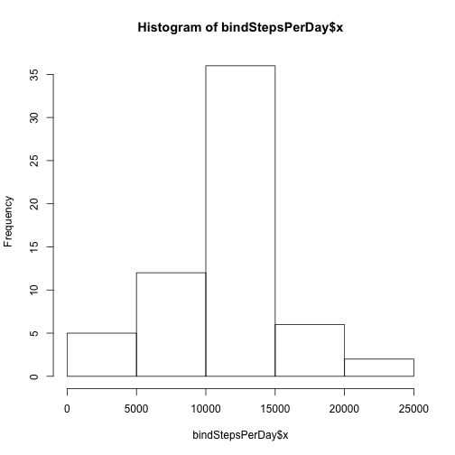
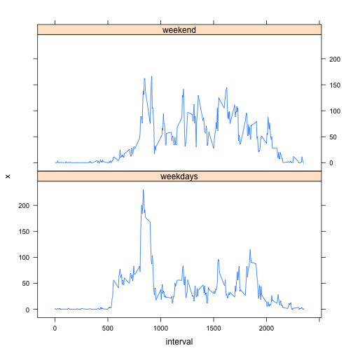

Activity Monitoring Analysis
========================================================

This analysis is produced to test the steps an individual takes throughout different points during a day measured by a personal activity monitering device. The data consists of two months of data from an anonymous individual collected during the months of October and November, 2012 and include the number of steps taken in 5 minute intervals each day.

Loading the raw data


```r
activityraw = read.csv("activity.csv")
```

Process/transform the data by removing the NA


```r
activity = activityraw[complete.cases(activityraw),]
```

Histogram of total number of steps each day


```r
stepsPerDay = aggregate(activity$steps, by=list(date=activity$date), FUN = sum)
hist(stepsPerDay$x)
```

 

Mean and Median of steps per day


```r
meanSteps = mean(stepsPerDay$x)
medianSteps = median(stepsPerDay$x)
meanSteps
```

```
## [1] 10766
```

```r
medianSteps
```

```
## [1] 10765
```

Time series plot of the 5-minute interval and the average number of steps taken, averaged across all days.


```r
stepsPerInterval = aggregate(activity$steps, by=list(interval=activity$interval), FUN = mean)
with(stepsPerInterval,plot(interval,x,type = "l"))
```

 

5 Minute interval maximum number of steps


```r
maxInterval = stepsPerInterval$interval[which(stepsPerInterval$x == max(stepsPerInterval$x))]
maxInterval
```

```
## [1] 835
```

Total number of missing values in the dataset 


```r
missingValue = table(complete.cases(activityraw))[1]
missingValue
```

```
## FALSE 
##  2304
```

Filling in all of the missing values in the dataset using the mean for the 5 minute interval


```r
subsetMisssingValue = activityraw[complete.cases(activityraw)==FALSE,]
mergeMV = merge(subsetMisssingValue,stepsPerInterval, all.x=T)
organizeMV = mergeMV[,c(4,3,1)]
names(organizeMV)[1]= "steps"
```

Create a new dataset that is equal to the original dataset but with the missing data filled in


```r
bindMV = rbind(activity, organizeMV)
```

Histogram of the total number of steps taken each day using the new dataset with the missing values filled in.


```r
bindStepsPerDay = aggregate(bindMV$steps, by=list(date=bindMV$date), FUN = sum)
hist(bindStepsPerDay$x)
```

 

Calculate and report the mean and median total number of steps taken per day.


```r
bindMeanSteps = mean(bindStepsPerDay$x)
bindMedianSteps = median(bindStepsPerDay$x)
bindMeanSteps
```

```
## [1] 10766
```

```r
bindMedianSteps
```

```
## [1] 10766
```
The impact of imputing the missing data is that the mean steps per day stays the same but the median changes


Create a new factor variable in the dataset with two levels – “weekday” and “weekend” indicating whether a given date is a weekday or weekend day


```r
library(lubridate)
bindMV$date = ymd(bindMV$date)
bindMV$day = weekdays(bindMV$date)
bindMV$weekdays = "weekdays"
bindMV$weekdays[bindMV$day %in% c("Sunday","Saturday")] = "weekend"
```

Plot containing a time series plot of the 5-minute interval and the average number of steps taken, averaged across all weekday days or weekend days


```r
bindStepsPerInterval = aggregate(bindMV$steps, by=list(interval=bindMV$interval,weekdays=bindMV$weekdays), FUN = mean)

library(lattice)
xyplot(x ~ interval | weekdays, data = bindStepsPerInterval, type = "l", layout=c(1,2))
```

 


